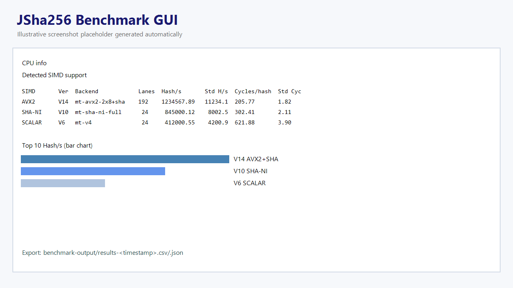

# JSha256


Win32 GUI benchmark for Bitcoin-style `double-SHA256` optimization stages `V1..V8`.

It detects CPU SIMD capabilities, runs all versions, and shows a ranked scoreboard with:

- `Hash/s`
- `Cycles/hash`
- backend used (`scalar-core`, `avx2-8lane-real`, `sha-ni-real`, ...)

## Project Layout

- `btc_sha_bench_gui.cpp` - GUI + benchmark engine
- `README_btc_sha_bench_gui.md` - technical implementation notes

## Optimization Versions

| Version | Description |
|---|---|
| `V1` | Midstate optimization |
| `V2` | Specialized schedule for first SHA block #2 |
| `V3` | Unrolled rounds for first SHA block #2 |
| `V4` | Specialized second SHA block |
| `V5` | Multi-lane benchmark mode (real AVX2 backend when available) |
| `V6` | Multi-threaded V4 on all logical cores |
| `V7` | SHA-NI full path (block #2 + second SHA with SHA intrinsics) |
| `V8` | AVX2 pipelined dual-batch mode (2x8 lanes in flight) |

## SIMD Features Reported

- `SSE2`
- `SSE4.1`
- `AVX`
- `AVX2`
- `AVX512F`
- `SHA-NI`

## Build (MSYS2 UCRT64)

```bash
g++ -std=c++17 -O3 -mavx2 -msha -municode btc_sha_bench_gui.cpp -o btc_sha_bench_gui.exe -lgdi32 -luser32
```

## Run

```bash
./btc_sha_bench_gui.exe
```

Then click `Run Benchmark V1..V8`.

## Example Scoreboard

```text
SIMD       Ver   Backend          Lanes   Hash/s          Cycles/hash
AVX2       V5    avx2-8lane-real  8       1234567.89      210.34
SHA-NI     V4    sha-ni-real      1       845000.12       305.77
SCALAR     V4    scalar-core      1       412000.55       622.11
```

## Screenshot Placeholder

Add GUI screenshot here (recommended path):

`docs/screenshot-main-window.png`

and embed it with:

```md

```
